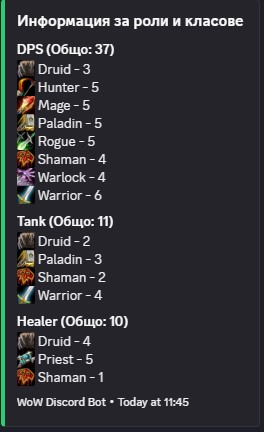
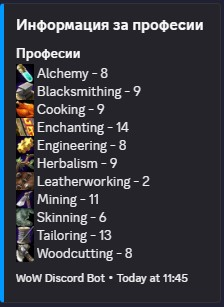

# Discord WoW Classes & Professions Bot

This bot allows your Discord server to manage **World of Warcraft classes, specializations, and professions** easily. Users can assign themselves classes, specializations, and professions directly through Discord commands.

---

## Features

- Self-assignable **classes** (`:warrior:`, `:priest:`, etc.).
- Self-assignable **specializations** (`:tank:`, `:dps:`, `:healer:`).
- Self-assignable **professions** (`:mining:`, `:cooking:`, etc.).
- Real-time updates for classes, specializations, and professions.
- Supports **custom Discord emojis** for better visuals.

---

## Screenshots

### Bot assigning classes and specializations


### Bot assigning professions


---

## Setup

1. Clone the repository:
   ```bash
   git clone https://github.com/yourusername/yourrepo.git
